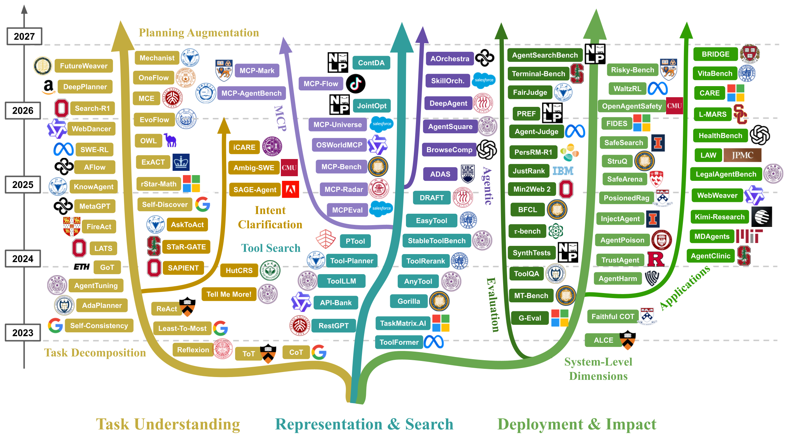
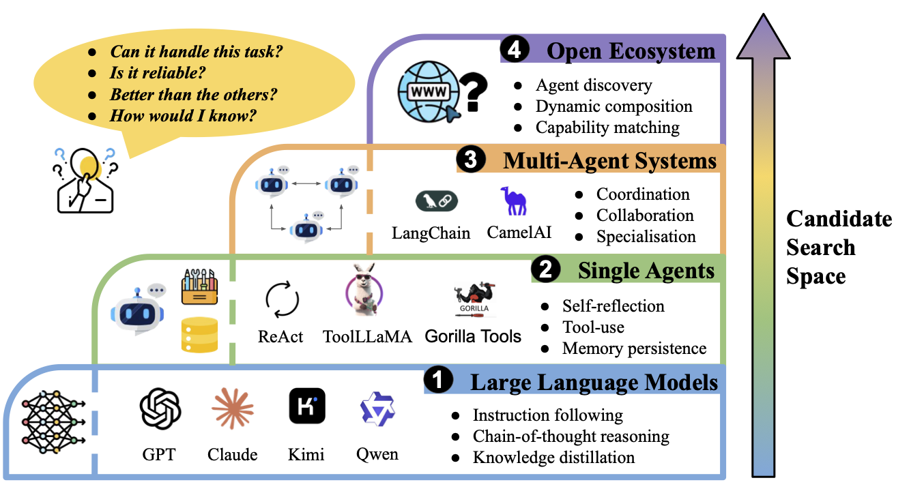
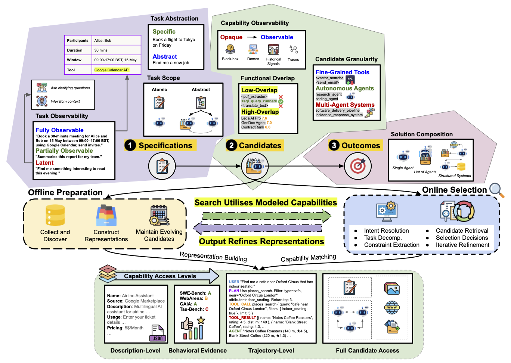
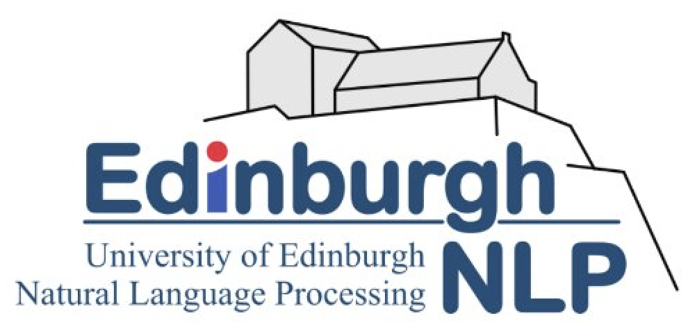

<div align="center">

# Awesome Agent Search

### A curated reading list accompanying *Agent and Tool Search: Foundations, Techniques, and Open Challenges*

[](https://awesome.re)

[](https://github.com/Bingo-W/Awesome-Agent-Search/pulls)
[](https://star-history.com/#Bingo-W/Awesome-Agent-Search)
[](LICENSE)


</div>

<p align="center">
    
</p>

## 📚 Citation

If you find this survey useful in your research and applications, please cite and ⭐ star / watch the repo for updates:

```bibtex
@article{wu2026agentsearch,
  title={Agent and Tool Search: Foundations, Techniques, and Open Challenges},
  author={Wu, Bin and Rahmani, Hossein A and Kim, To Eun and Mammadli, Arastun and 
          Qiao, Shuofei and Fu, Xiao and Ramineni, Varsha and Zhang, Xiaoyu and Meng, 
          Chuan and Drayson, George and Chowdhury, Anu and Ramos, Jerome and Maiga, 
          Abdine and Yilmaz, Emine},
  year={2026},
  publisher={Preprints}
}
```

> [!TIP]
> 👋 This repository tracks the fast-moving literature on **agent and tool search**: how systems discover, represent, retrieve, rank, and evaluate agents and tools for a given task. If you know a paper we're missing, or work in this space yourself, PRs are very welcome (see [Contributing](#-contributing)).

<p align="center">
  
</p>

<p align="center"><em>Evolution of research directions related to agent search from 2023 to 2026. Existing work has progressed from task understanding and planning capabilities, through representation and search mechanisms for tools and agents, toward deployment-oriented concerns such as evaluation, safety, robustness, and domain-specific applications. Together, these developments form the broader research landscape that underpins agent search systems.</em></p>


## Motivating Agent Search

<p align="center">
  
</p>

## Conceptual Framework of Agent Search

<p align="center">
  
</p>

---

## 📋 Table of Contents

| Section | Subsections |
|---|---|
| [1. Task Understanding](#1-task-understanding) | [1.1 Task Decomposition](#11-task-decomposition) · [1.2 Planning Augmentation](#12-planning-augmentation) · [1.3 Proactive User Intent Clarification](#13-proactive-user-intent-clarification) |
| [2. Agent Discovery, Representation & Indexing](#2-agent-discovery-representation-and-indexing) | [2.1 Units of Discovery](#21-units-of-discovery) · [2.2 Tool Representation Surfaces](#22-tool-representation-surfaces) · [2.3 Indexing & Retrieval Backends](#23-indexing-and-retrieval-backends) · [2.4 Agent Representations](#24-agent-representations) · [2.5 Maintenance](#25-maintenance-drift-updates-and-missing-information) |
| [3. Retrieval, Reranking & Selection of Agents](#3-retrieval-reranking-and-selection-of-agents) | [3.1 Agent/Tool Selection](#31-agenttool-selection) · [3.2 Iterative Tool Retrieval](#32-iterative-tool-retrieval) · [3.3 Agent and Tool Recommendation](#33-agent-and-tool-recommendation) |
| [4. Evaluation of Agent Search](#4-evaluation-of-agent-search) | [4.1 Intrinsic Evaluation](#41-intrinsic-evaluation) · [4.2 Extrinsic Evaluation](#42-extrinsic-evaluation) |
| [5. System-Level Dimensions](#5-system-level-dimensions) | [5.1 Safety](#51-safety) · [5.2 Bias and Fairness](#52-bias-and-fairness) · [5.3 Security Risks](#53-security-risks) · [5.4 Personalization](#54-personalization) · [5.5 Transparency & Explainability](#55-transparency-and-explainability) |
| [6. Applications](#6-applications) | [6.1 Healthcare](#61-healthcare) · [6.2 Law](#62-law) · [6.3 Deep Research](#63-deep-research) |
| [Related Resources](#-related-resources) | — |
| [Contributing](#-contributing) | — |

---

## 1. Task Understanding

Transforming user tasks into actionable requirement specifications for downstream agent search — task decomposition, planning augmentation, and proactive intent clarification.

### 1.1 Task Decomposition

*Sequential/global, iterative, and structured (tree/graph) strategies for breaking a task into sub-tasks.*

| Paper | Venue |
|---|---|
| [Describe, Explain, Plan and Select: Interactive Planning with LLMs Enables Open-World Multi-Task Agents](https://arxiv.org/pdf/2302.01560) | NeurIPS 2023 |
| [AdaPlanner: Adaptive Planning from Feedback with Language Models](https://proceedings.neurips.cc/paper_files/paper/2023/file/b5c8c1c117618267944b2617add0a766-Paper-Conference.pdf) | NeurIPS 2023 |
| [Reasoning with Language Model is Planning with World Model (RAP)](https://aclanthology.org/2023.emnlp-main.507/) | EMNLP 2023 |
| [Leveraging Pre-trained Large Language Models to Construct and Utilize World Models for Model-based Task Planning](https://openreview.net/forum?id=zDbsSscmuj) | NeurIPS 2023 |
| [ADAPT: As-Needed Decomposition and Planning with Language Models](https://aclanthology.org/2024.findings-naacl.264.pdf) | NAACL Findings 2024 |
| [TaskLAMA: Probing the Complex Task Understanding of Language Models](https://arxiv.org/abs/2207.01366) | AAAI 2024 |
| [TaskBench: Benchmarking Large Language Models for Task Automation](https://arxiv.org/abs/2311.18760) | NeurIPS 2024 |
| [Can Graph Learning Improve Planning in LLM-based Agents?](https://proceedings.neurips.cc/paper_files/paper/2024/file/098d1bd3eb6156a4c2f834563cdcf617-Paper-Conference.pdf) | NeurIPS 2024 |
| [What's the Plan? Evaluating and Developing Planning-Aware Techniques for Language Models](https://arxiv.org/abs/2402.11489) | arXiv 2024 |
| [Understanding the Planning of LLM Agents: A Survey](https://arxiv.org/pdf/2402.02716) | arXiv 2024 |
| [Tree Search for Language Model Agents](https://arxiv.org/abs/2407.01476) | arXiv 2024 |
| [LATS: Language Agent Tree Search Unifies Reasoning, Acting, and Planning](https://openreview.net/forum?id=6LNTSrJjBe) | ICML 2024 |
| [WebDART: Dynamic Decomposition and Re-planning for Complex Web Tasks](https://arxiv.org/abs/2510.06587) | arXiv 2025 |
| [GAP: Graph-based Agent Planning with Parallel Tool Use and Reinforcement Learning](https://arxiv.org/abs/2510.25320) | arXiv 2025 |
| [ALAS: Transactional and Dynamic Multi-Agent LLM Planning](https://arxiv.org/abs/2511.03094) | arXiv 2025 |
| [SelfGoal: Your Language Agents Already Know How to Achieve High-Level Goals](https://aclanthology.org/2025.naacl-long.36.pdf) | NAACL 2025 |
| [RECAP: Recursive Context-Aware Reasoning and Planning for LLM Agents](https://arxiv.org/pdf/2510.23822) | arXiv 2025 |
| [THREAD: Thinking Deeper with Recursive Spawning](https://aclanthology.org/2025.naacl-long.427.pdf) | NAACL 2025 |
| [ParaCook: On Time-Efficient Planning for Multi-Agent Systems](https://arxiv.org/abs/2510.11608) | arXiv 2025 |
| [FutureWeaver: Planning Test-Time Compute for Multi-Agent Systems with Modularized Collaboration](https://arxiv.org/pdf/2512.11213) | arXiv 2025 |
| [Reason-Plan-ReAct: A Reasoner-Planner Supervising a ReAct Executor for Complex Enterprise Tasks](https://arxiv.org/pdf/2512.03560) | AAAI Workshop |
| [ReAcTree: Hierarchical LLM Agent Trees with Control Flow for Long-Horizon Task Planning](https://arxiv.org/pdf/2511.02424) | arXiv 2025 |
| [TPS-Bench: Evaluating AI Agents' Tool Planning & Scheduling Abilities in Compounding Tasks](https://arxiv.org/pdf/2511.01527) | arXiv 2025 |
| [CostBench: Evaluating Multi-Turn Cost-Optimal Planning and Adaptation in Dynamic Environments for LLM Tool-Use Agents](https://arxiv.org/abs/2511.02734) | arXiv 2025 |
| [Verification-Aware Planning for Multi-Agent Systems](https://arxiv.org/pdf/2510.17109) | arXiv 2025 |
| [DeepPlanner: Scaling Planning Capability for Deep Research Agents via Advantage Shaping](https://arxiv.org/pdf/2510.12979) | arXiv 2025 |
| [PlanGenLLMs: A Modern Survey of LLM Planning Capabilities](https://aclanthology.org/2025.acl-long.958.pdf) | ACL 2025 |
| [End-to-End Planning Framework with Agentic LLMs and PDDL](https://arxiv.org/pdf/2512.09629) | arXiv 2025 |
| [ToolTree: Efficient LLM Agent Tool Planning via Dual-Feedback Monte Carlo Tree Search and Bidirectional Pruning](https://openreview.net/forum?id=Ef5O9gNNLE) | ICLR 2026 |

### 1.2 Planning Augmentation

*Agentic post-training (SFT/RL), multi-agent frameworks, and planning offloading to boost planning capability.*

| Paper | Venue |
|---|---|
| [LLM+P: Empowering Large Language Models with Optimal Planning Proficiency](https://arxiv.org/abs/2304.11477) | arXiv 2023 |
| [RestGPT: Connecting Large Language Models with Real-World RESTful APIs](https://arxiv.org/abs/2306.06624) | arXiv 2023 |
| [CAMEL: Communicative Agents for "Mind" Exploration of Large Language Model Society](https://proceedings.neurips.cc/paper_files/paper/2023/hash/a3621ee907def47c1b952ade25c67698-Abstract-Conference.html) | NeurIPS 2023 |
| [HuggingGPT: Solving AI Tasks with ChatGPT and its Friends in Hugging Face](https://proceedings.neurips.cc/paper_files/paper/2023/file/77c33e6a367922d003ff102ffb92b658-Paper-Conference.pdf) | NeurIPS 2023 |
| [FireAct: Toward Language Agent Fine-Tuning](https://arxiv.org/pdf/2310.05915) | arXiv 2023 |
| [BOLAA: Benchmarking and Orchestrating LLM-Augmented Autonomous Agents](https://arxiv.org/abs/2308.05960) | arXiv 2023 |
| [MetaGPT: Meta Programming for a Multi-Agent Collaborative Framework](https://openreview.net/forum?id=VtmBAGCN7o) | ICLR 2024 (Oral) |
| [ChatDev: Communicative Agents for Software Development](https://aclanthology.org/2024.acl-long.810/) | ACL 2024 |
| [Agent-FLAN: Designing Data and Methods of Effective Agent Tuning for Large Language Models](https://aclanthology.org/2024.findings-acl.557/) | ACL Findings 2024 |
| [AgentTuning: Enabling Generalized Agent Abilities for LLMs](https://aclanthology.org/2024.findings-acl.181.pdf) | ACL Findings 2024 |
| [AutoAct: Automatic Agent Learning from Scratch for QA via Self-Planning](https://arxiv.org/abs/2401.05268) | ACL 2024 |
| [Agent Lumos: Unified and Modular Training for Open-Source Language Agents](https://arxiv.org/abs/2311.05657) | ACL 2024 |
| [Trial and Error: Exploration-Based Trajectory Optimization for LLM Agents (ETO)](https://arxiv.org/abs/2403.02502) | ACL 2024 |
| [KnowAgent: Knowledge-Augmented Planning for LLM-Based Agents](https://arxiv.org/abs/2403.03101) | NAACL 2024 |
| [Magentic-One: A Generalist Multi-Agent System for Solving Complex Tasks](https://arxiv.org/abs/2411.04468) | arXiv 2024 |
| [Internet of Agents: Weaving a Web of Heterogeneous Agents for Collaborative Intelligence](https://openreview.net/forum?id=o1Et3MogPw) | ICLR 2025 |
| [OWL: Optimized Workforce Learning for General Multi-Agent Assistance in Real-World Task Automation](https://arxiv.org/pdf/2505.23885) | NeurIPS 2025 |
| [ToolRL: Reward is All Tool Learning Needs](https://proceedings.neurips.cc/paper_files/paper/2025/hash/97c5b2707228e7e3fb67e4ecc2e0e607-Abstract-Conference.html) | NeurIPS 2025 |
| [EmbodiedBrain: Expanding Performance Boundaries of Task Planning for Embodied Intelligence](https://arxiv.org/pdf/2510.20578) | arXiv 2025 |
| [AgentGen: Enhancing Planning Abilities for LLM-Based Agents via Environment and Task Generation](https://dl.acm.org/doi/epdf/10.1145/3690624.3709321) | KDD 2025 |
| [End-to-End Planning Framework with Agentic LLMs and PDDL](https://arxiv.org/pdf/2512.09629) | arXiv 2025 |
| [AOrchestra: Automating Sub-Agent Creation for Agentic Orchestration](https://arxiv.org/abs/2602.03786) | ICML 2026 |
| [Holistic Agent Leaderboard: The Missing Infrastructure for AI Agent Evaluation](https://arxiv.org/abs/2510.11977) | arXiv 2025 |
| [Meta-Harness: End-to-End Optimization of Model Harnesses](https://arxiv.org/abs/2603.28052) | arXiv 2026 |
| [Agentic Harness Engineering: Observability-Driven Automatic Evolution of Coding-Agent Harnesses](https://arxiv.org/abs/2604.25850) | arXiv 2026 |
| [Retrospective Harness Optimization: Improving LLM Agents via Self-Preference over Trajectory Rollouts](https://arxiv.org/abs/2606.05922) | arXiv 2026 |
| [Adaptive Auto-Harness: Sustained Self-Improvement for Agentic System Deployment on Open-Ended Task Streams](https://arxiv.org/abs/2606.01770) | arXiv 2026 |
| [MemoHarness: Agent Harnesses That Learn from Experience](https://arxiv.org/abs/2607.14159) | arXiv 2026 |
| [Harness-Bench: Measuring Harness Effects across Models in Realistic Agent Workflows](https://arxiv.org/abs/2605.27922) | arXiv 2026 |
| [Self-Harness: Harnesses That Improve Themselves](https://arxiv.org/abs/2606.09498) | arXiv 2026 |

### 1.3 Proactive User Intent Clarification

*Closed-ended attribute-based and open-ended language-based clarification; agent-vs-human user intent.*

| Paper | Venue |
|---|---|
| [Generating Clarifying Questions for Information Retrieval](https://dl.acm.org/doi/10.1145/3366423.3380126) | WWW 2020 |
| [Unified Conversational Recommendation Policy Learning via Graph-Based RL (UNICORN)](https://dl.acm.org/doi/abs/10.1145/3404835.3462913) | SIGIR 2021 |
| [HutCRS: Hierarchical User-Interest Tracking for Conversational Recommender System](https://aclanthology.org/2023.emnlp-main.635/) | EMNLP 2023 |
| [System Initiative Prediction for Multi-turn Conversational Information Seeking](https://dl.acm.org/doi/10.1145/3583780.3615070) | CIKM 2023 |
| [Tell Me More! Towards Implicit User Intention Understanding of Language Model Driven Agents (Mistral-Interact)](https://aclanthology.org/2024.acl-long.61/) | ACL 2024 |
| [SAPIENT: Mastering Multi-Turn Conversational Recommendation with Strategic Planning and MCTS](https://aclanthology.org/2025.naacl-long.133/) | NAACL 2025 |
| [AskToAct: Enhancing LLMs Tool Use via Self-Correcting Clarification](https://aclanthology.org/2025.emnlp-main.682.pdf) | EMNLP 2025 |
| [Bridging the Gap: From Ad-hoc to Proactive Search in Conversations](https://arxiv.org/abs/2506.00983) | SIGIR 2025 |
| [Designing Intent Communication for Agent-Human Collaboration](https://arxiv.org/abs/2510.20409) | MUM 2025 |
| [A Comparative Analysis of Linguistic and Retrieval Diversity in LLM-Generated Search Queries](https://dl.acm.org/doi/10.1145/3746252.3761382) | CIKM 2025 |
| [Ambig-SWE: Interactive Agents to Overcome Underspecificity in Software Engineering](https://arxiv.org/abs/2502.13069) | ICLR 2026 |
| [Structured Uncertainty Guided Clarification for LLM Agents (SAGE-Agent)](https://arxiv.org/abs/2511.08798) | ACL 2026 |
| [MAC: A Multi-Agent Framework for Interactive User Clarification in Multi-Turn Conversations](https://arxiv.org/abs/2512.13154) | ACL 2026 |
| [Behind the Prompt: The Agent-User Problem in Information Retrieval](https://arxiv.org/pdf/2603.03630) | arXiv 2026 |
| [A Picture of Agentic Search (ASQ)](https://arxiv.org/abs/2602.17518) | arXiv 2026 |

---

## 2. Agent Discovery, Representation and Indexing

How agents and tools are discovered as retrieval units, represented for matching, indexed for scalable search, and kept up to date as the candidate ecosystem evolves.

### 2.1 Units of Discovery

*API-level tools, toolkits/packages, and agents as registries/catalogs — the retrieval unit itself.*

| Paper | Venue |
|---|---|
| [TaskMatrix.AI: Completing Tasks by Connecting Foundation Models with Millions of APIs](https://arxiv.org/abs/2303.16434) | arXiv 2023 |
| [Toolformer: Language Models Can Teach Themselves to Use Tools](https://dl.acm.org/doi/10.5555/3666122.3669119) | NeurIPS 2023 |
| [API-Bank: A Comprehensive Benchmark for Tool-Augmented LLMs](https://aclanthology.org/2023.emnlp-main.187.pdf) | EMNLP 2023 |
| [Gorilla: Large Language Model Connected with Massive APIs](https://papers.nips.cc/paper_files/paper/2024/hash/e4c61f578ff07830f5c37378dd3ecb0d-Abstract-Conference.html) | NeurIPS 2024 |
| [ToolLLM: Facilitating Large Language Models to Master 16000+ Real-World APIs](https://openreview.net/forum?id=dHng2O0Jjr) | ICLR 2024 |
| [MetaTool: Deciding Whether to Use Tools and Which to Use](https://arxiv.org/pdf/2310.03128) | ICLR 2024 |
| [ToolRerank: Adaptive and Hierarchy-Aware Reranking for Tool Retrieval](https://aclanthology.org/2024.lrec-main.1413.pdf) | COLING 2024 |
| [Dynamic ReAct: Scalable Tool Selection for Large-Scale MCP Environments](https://arxiv.org/abs/2509.20386) | arXiv 2025 |
| [MCP-Zero: Active Tool Discovery for Autonomous LLM Agents](https://arxiv.org/abs/2506.01056) | arXiv 2025 |
| [Tool Learning with Foundation Models *(survey)*](https://dl.acm.org/doi/10.1145/3704435) | ACM Computing Surveys 2024 |

### 2.2 Tool Representation Surfaces

*Names, natural-language docs, schemas, usage examples, and learned tool tokens/embeddings.*

| Paper | Venue |
|---|---|
| [ToolkenGPT: Augmenting Frozen Language Models with Massive Tools via Tool Embeddings](https://dl.acm.org/doi/10.5555/3666122.3668110) | NeurIPS 2023 |
| [Tool Documentation Enables Zero-Shot Tool-Usage with Large Language Models](https://arxiv.org/abs/2308.00675) | arXiv 2023 |
| [ToolGen: Unified Tool Retrieval and Calling via Generation](https://openreview.net/forum?id=XLMAMmowdY) | ICLR 2025 |
| [Psychometric Tests for AI Agents and Their Moduli Space](https://arxiv.org/abs/2511.19262) | arXiv 2025 |
| [Classification-Based Concurrent API Calls and External Tool Categories](https://www.nature.com/articles/s41598-025-06469-w) | Scientific Reports 2025 |
| [PLAY2PROMPT: Zero-Shot Tool Instruction Optimization for LLM Agents via Tool Play](https://arxiv.org/pdf/2503.14432) | ACL 2025 |
| [From Exploration to Mastery: Enabling LLMs to Master Tools via Self-Driven Interactions](https://arxiv.org/pdf/2410.08197) | ICLR 2025 |
| [EasyTool: Enhancing LLM-Based Agents with Concise Tool Instruction](https://arxiv.org/pdf/2401.06201) | NAACL 2025 |
| [A Joint Optimization Framework for Enhancing Efficiency of Tool Utilization in LLM Agents](https://aclanthology.org/2025.findings-acl.1149.pdf) | ACL Findings 2025 |
| [DeepCodeSeek: Real-Time API Retrieval for Context-Aware Code Generation](https://arxiv.org/abs/2509.25716) | ECAI 2025 |
| [DeepAgent: A General Reasoning Agent with Scalable Toolsets](https://arxiv.org/abs/2510.21618) | WWW 2026 |

### 2.3 Indexing and Retrieval Backends

*Sparse/dense indexes, rerankers, hierarchical catalogs, query rewriting, and generation-as-retrieval over tool libraries.*

| Paper | Venue |
|---|---|
| [Enhancing Tool Retrieval with Iterative Feedback from Large Language Models](https://arxiv.org/abs/2406.17465) | EMNLP 2023 |
| [ProTIP: Progressive Tool Retrieval Improves Planning](https://arxiv.org/pdf/2312.10332) | arXiv 2023 |
| [ToolNet: Connecting Large Language Models with Massive Tools via Tool Graph](https://arxiv.org/abs/2403.00839) | arXiv 2024 |
| [Towards Completeness-Oriented Tool Retrieval for Large Language Models (COLT)](https://dl.acm.org/doi/10.1145/3627673.3679847) | CIKM 2024 |
| [Re-Invoke: Tool Invocation Rewriting for Zero-Shot Tool Retrieval](https://aclanthology.org/2024.findings-emnlp.270/) | EMNLP Findings 2024 |
| [Tulip Agent: Enabling LLM-Based Agents to Solve Tasks Using Large Tool Libraries](https://arxiv.org/abs/2407.21778) | arXiv 2024 |
| [AnyTool: Self-Reflective, Hierarchical Agents for Large-Scale API Calls](https://dl.acm.org/doi/10.5555/3692070.3692540) | ICML 2024 |
| [CRAFT: Customizing LLMs by Creating and Retrieving from Specialized Toolsets](https://proceedings.iclr.cc/paper_files/paper/2024/file/af31604708f3e44b4de9fdfa6dcaa9d1-Paper-Conference.pdf) | ICLR 2024 |
| [Efficient and Scalable Estimation of Tool Representations in Vector Space (ToolBank)](https://arxiv.org/pdf/2409.02141) | arXiv 2024 |
| [Toolken+: Improving LLM Tool Usage with Reranking and a Reject Option](https://aclanthology.org/2024.findings-emnlp.345.pdf) | EMNLP Findings 2024 |
| [Data-Efficient Massive Tool Retrieval: An RL Approach for Query-Tool Alignment (QTA)](https://dl.acm.org/doi/abs/10.1145/3673791.3698429) | SIGIR-AP 2024 |
| [Planning and Editing What You Retrieve for Enhanced Tool Learning (PLUTO)](https://aclanthology.org/2024.findings-naacl.61.pdf) | NAACL Findings 2024 |
| [AVATAR: Optimizing LLM Agents for Tool-Assisted Knowledge Retrieval](https://arxiv.org/pdf/2406.11200v2) | NeurIPS 2024 |
| [Benchmarking Tool Retrieval for Large Language Models (ToolRet)](https://aclanthology.org/2025.findings-acl.1258.pdf) | ACL Findings 2025 |
| [MassTool: A Multi-Task Search-Based Tool Retrieval Framework for LLMs](https://arxiv.org/abs/2507.00487) | arXiv 2025 |
| [Improving Tool Retrieval by Leveraging Large Language Models for Query Generation](https://aclanthology.org/2025.coling-industry.3.pdf) | COLING Industry 2025 |
| [ToolReAGt: Tool Retrieval for LLM-Based Complex Task Solution via Retrieval Augmented Generation](https://aclanthology.org/2025.knowllm-1.7/) | ACL Workshop (KnowLLM) 2025 |
| [ToolLibGen: Scalable Automatic Tool Creation and Aggregation for LLM Reasoning](https://arxiv.org/abs/2510.07768) | arXiv 2025 |
| [Tool-Planner: Task Planning with Clusters across Multiple Tools](https://arxiv.org/pdf/2406.03807) | ICLR 2025 |
| [Tool-to-Agent Retrieval: Bridging Tools and Agents for Scalable LLM Multi-Agent Systems](https://arxiv.org/abs/2511.01854) | arXiv 2025 |
| [Tools Are Under-Documented: Simple Document Expansion Boosts Tool Retrieval](https://arxiv.org/abs/2510.22670) | ICLR 2026 |
| [ToolDreamer: Instilling LLM Reasoning into Tool Retrievers](https://arxiv.org/abs/2510.19791) | ACL 2026 |
| [Beyond Single-Shot: Multi-Step Tool Retrieval via Query Planning](https://arxiv.org/abs/2601.07782) | ACL 2026 |
| [Multi-Field Tool Retrieval](https://arxiv.org/pdf/2602.05366) | arXiv 2026 |

### 2.4 Agent Representations

*Policy/prompt, capability/profile, and routing-metadata representations; automated agent design and composition.*

| Paper | Venue |
|---|---|
| [AgentVerse: Facilitating Multi-Agent Collaboration and Exploring Emergent Behaviors](https://proceedings.iclr.cc/paper_files/paper/2024/file/578e65cdee35d00c708d4c64bce32971-Paper-Conference.pdf) | ICLR 2024 |
| [LIMP: Large Language Model Enhanced Intent-Aware Mobility Prediction](https://arxiv.org/pdf/2408.12832) | arXiv 2024 |
| [Dynamic LLM-Agent Network: An LLM Agent Collaboration Framework with Agent Team Optimization (DyLAN)](https://arxiv.org/pdf/2310.02170) | COLM 2024 |
| [DSPy: Compiling Declarative Language Model Calls into State-of-the-Art Pipelines](https://arxiv.org/pdf/2310.03714) | ICLR 2024 |
| [Trace Is the Next Autodiff: Generative Optimization with Rich Feedback, Execution Traces, and LLMs (OptoPrime)](https://proceedings.neurips.cc/paper_files/paper/2024/file/83ba7056bce2c3c3c27e17397cf3e1f0-Paper-Conference.pdf) | NeurIPS 2024 |
| [GPTSwarm: Language Agents as Optimizable Graphs](https://openreview.net/pdf?id=uTC9AFXIhg) | ICML 2024 |
| [Symbolic Learning Enables Self-Evolving Agents](https://arxiv.org/pdf/2406.18532) | arXiv 2024 |
| [MasRouter: Learning to Route LLMs for Multi-Agent Systems](https://arxiv.org/pdf/2502.11133) | ACL 2025 |
| [Automated Design of Agentic Systems (ADAS)](https://openreview.net/pdf?id=t9U3LW7JVX) | ICLR 2025 |
| [Self-Improving AI Agents through Self-Play](https://arxiv.org/abs/2512.02731) | arXiv 2025 |
| [Automated Composition of Agents: A Knapsack Approach for Agentic Component Selection](https://arxiv.org/pdf/2510.16499) | NeurIPS 2025 |
| [ToolOrchestra: Elevating Intelligence via Efficient Model and Tool Orchestration](https://arxiv.org/abs/2511.21689) | arXiv 2025 |
| [AgentSquare: Automatic LLM Agent Search in Modular Design Space](https://arxiv.org/pdf/2410.06153) | ICLR 2025 |
| [MetaAgents: Large Language Model Based Agents for Decision-Making on Teaming](https://arxiv.org/pdf/2310.06500) | arXiv 2025 |
| [Large Language Model-Driven Meta-Structure Discovery in Heterogeneous Information Networks (ReStruct)](https://dl.acm.org/doi/pdf/10.1145/3637528.3671965) | KDD 2025 |
| [AutoFlow: Automated Workflow Generation for Large Language Model Agents](https://arxiv.org/pdf/2407.12821) | ICLR Oral 2025 |
| [AFlow: Automating Agentic Workflow Generation](https://openreview.net/pdf?id=z5uVAKwmjf) | ICLR 2025 |
| [SkillOrchestra: Learning to Route Agents via Skill Transfer](https://arxiv.org/abs/2602.19672) | arXiv 2026 |

### 2.5 Maintenance: Drift, Updates, and Missing Information

*Keeping representations/indexes accurate as tools, APIs, and agents evolve.*

| Paper | Venue |
|---|---|
| [StableToolBench: Towards Stable Large-Scale Benchmarking on Tool Learning of Large Language Models](https://aclanthology.org/2024.findings-acl.664/) | ACL Findings 2024 |
| [Beyond Static Toolsets: Self-Evolving LLM Tool Agents via Continual Documentation Adaptation](https://aclanthology.org/2026.findings-acl.1082/) | ACL Findings 2026 |

---

## 3. Retrieval, Reranking, and Selection of Agents

How candidates are ranked and selected once represented and indexed — similarity matching, LLM-based reasoning, structure-aware search, iterative retrieval, and preference-driven recommendation.

### 3.1 Agent/Tool Selection

*Similarity matching, LLM-based (training-free/training-based) selection, and structure-aware retrieval.*

| Paper | Venue |
|---|---|
| [Toolken+: Improving LLM Tool Usage with Reranking and a Reject Option](https://aclanthology.org/2024.findings-emnlp.345.pdf) | EMNLP Findings 2024 |
| [ToolRerank: Adaptive and Hierarchy-Aware Reranking for Tool Retrieval](https://aclanthology.org/2024.lrec-main.1413.pdf) | COLING 2024 |
| [Towards Completeness-Oriented Tool Retrieval for Large Language Models (COLT)](https://dl.acm.org/doi/epdf/10.1145/3627673.3679847) | CIKM 2024 |
| [Data-Efficient Massive Tool Retrieval: An RL Approach for Query-Tool Alignment (QTA)](https://dl.acm.org/doi/abs/10.1145/3673791.3698429) | SIGIR-AP 2024 |
| [Re-Invoke: Tool Invocation Rewriting for Zero-Shot Tool Retrieval](https://aclanthology.org/2024.findings-emnlp.270/) | EMNLP Findings 2024 |
| [AVATAR: Optimizing LLM Agents for Tool-Assisted Knowledge Retrieval](https://arxiv.org/pdf/2406.11200v2) | NeurIPS 2024 |
| [CRAFT: Customizing LLMs by Creating and Retrieving from Specialized Toolsets](https://openreview.net/pdf?id=G0vdDSt9XM) | ICLR 2024 |
| [Retrieval Models Aren't Tool-Savvy: Benchmarking Tool Retrieval for Large Language Models (ToolRet)](https://arxiv.org/pdf/2503.01763) | ACL 2025 |
| [MassTool: A Multi-Task Search-Based Tool Retrieval Framework for LLMs](https://arxiv.org/abs/2507.00487) | arXiv 2025 |
| [Online-Optimized RAG for Tool Use and Function Calling](https://arxiv.org/pdf/2509.20415) | arXiv 2025 |
| [Position: Toward a Theory of Agents as Tool-Use Decision-Makers](https://arxiv.org/abs/2506.00886) | arXiv 2025 |
| [Multi-Field Tool Retrieval (MFTR)](https://arxiv.org/pdf/2602.05366) | arXiv 2026 |

### 3.2 Iterative Tool Retrieval

*Reason-act-reflection loops and iterative query reformulation for retrieval that co-evolves with task execution.*

| Paper | Venue |
|---|---|
| [Enhancing Tool Retrieval with Iterative Feedback from Large Language Models](https://arxiv.org/pdf/2406.17465) | EMNLP 2023 |
| [AnyTool: Self-Reflective, Hierarchical Agents for Large-Scale API Calls](https://arxiv.org/abs/2402.04253) | ICML 2024 |
| [Tulip Agent: Enabling LLM-Based Agents to Solve Tasks Using Large Tool Libraries](https://arxiv.org/abs/2407.21778) | arXiv 2024 |
| [Planning and Editing What You Retrieve for Enhanced Tool Learning (PLUTO)](https://aclanthology.org/2024.findings-naacl.61.pdf) | NAACL Findings 2024 |
| [ReAct: Synergizing Reasoning and Acting in Language Models](https://openreview.net/forum?id=WE_vluYUL-X) | ICLR 2024 |
| [MCP-Zero: Active Tool Discovery for Autonomous LLM Agents](https://arxiv.org/abs/2506.01056) | arXiv 2025 |
| [Dynamic ReAct: Scalable Tool Selection for Large-Scale MCP Environments](https://arxiv.org/abs/2509.20386) | arXiv 2025 |
| [ToolReAGt: Tool Retrieval for LLM-Based Complex Task Solution via Retrieval Augmented Generation](https://aclanthology.org/2025.knowllm-1.7/) | ACL Workshop (KnowLLM) 2025 |
| [ToolGen: Unified Tool Retrieval and Calling via Generation](https://openreview.net/forum?id=XLMAMmowdY) | ICLR 2025 |
| [BrowseComp-Plus: A More Fair and Transparent Evaluation Benchmark of Deep-Research Agent](https://aclanthology.org/2026.acl-long.1023/) | ACL 2026 |
| [Online-Optimized RAG for Tool Use and Function Calling](https://arxiv.org/pdf/2509.20415) | arXiv 2025 |
| [DeepAgent: A General Reasoning Agent with Scalable Toolsets](https://arxiv.org/abs/2510.21618) | WWW 2026 |
| [AgentIR: Reasoning-Aware Retrieval for Deep Research Agents](https://arxiv.org/abs/2603.04384) | arXiv 2026 |

### 3.3 Agent and Tool Recommendation

*Mining behavioral history / preferences to personalize agent or tool selection.*

| Paper | Venue |
|---|---|
| [RecMind: Large Language Model Powered Agent For Recommendation](https://aclanthology.org/2024.findings-naacl.271/) | NAACL Findings 2024 |
| [AgentCF: Collaborative Learning with Autonomous Language Agents for Recommender Systems](https://dl.acm.org/doi/10.1145/3589334.3645537) | WWW 2024 |
| [Collaborative Large Language Model for Recommender Systems (CLLM4Rec)](https://dl.acm.org/doi/10.1145/3589334.3645347) | WWW 2024 |
| [Prospect Personalized Recommendation on LLM-Based Agent Platform (Rec4Agentverse)](https://arxiv.org/abs/2402.18240) | arXiv 2024 |
| [On Generative Agents in Recommendation](https://dl.acm.org/doi/10.1145/3626772.3657844) | SIGIR 2024 |
| [Agentic Feedback Loop Modeling Improves Recommendation and User Simulation (AFL)](https://dl.acm.org/doi/10.1145/3726302.3729893) | SIGIR 2025 |
| [Recommender AI Agent: Integrating Large Language Models for Interactive Recommendations](https://dl.acm.org/doi/10.1145/3731446) | TOIS 2025 |
| [Reinforced Prompt Personalization for Recommendation with Large Language Models (RPP)](https://dl.acm.org/doi/10.1145/3716320) | TOIS 2025 |
| [PersonaX: A Recommendation Agent-Oriented User Modeling Framework for Long Behavior Sequence](https://aclanthology.org/2025.findings-acl.300.pdf) | ACL Findings 2025 |
| [Advancing and Benchmarking Personalized Tool Invocation for LLMs (PTool)](https://arxiv.org/abs/2505.04072) | arXiv 2025 |
| [AgentSelect: Benchmark for Narrative Query-to-Agent Recommendation](https://arxiv.org/abs/2603.03761) | ICML 2026 |

---

## 4. Evaluation of Agent Search

Intrinsic evaluation of the search process itself, and extrinsic evaluation of downstream task outcomes.

### 4.1 Intrinsic Evaluation

*Retrieval quality, invocation correctness, and tool/agent-use benchmarks assessed against annotated ground truth.*

| Paper | Venue |
|---|---|
| [API-Bank: A Comprehensive Benchmark for Tool-Augmented LLMs](https://aclanthology.org/2023.emnlp-main.187.pdf) | EMNLP 2023 |
| [ToolQA: A Dataset for LLM Question Answering with External Tools](https://proceedings.neurips.cc/paper_files/paper/2023/hash/9cb2a7495900f8b602cb10159246a016-Abstract-Datasets_and_Benchmarks.html) | NeurIPS 2023 |
| [ToolAlpaca: Generalized Tool Learning for Language Models with 3000 Simulated Cases](https://arxiv.org/abs/2306.05301) | arXiv 2023 |
| [Can Large Language Models Be an Alternative to Human Evaluations?](https://aclanthology.org/2023.acl-long.870/) | ACL 2023 |
| [LLMs in the Imaginarium: Tool Learning through Simulated Trial and Error (STE)](https://aclanthology.org/2024.acl-long.570/) | ACL 2024 |
| [T-Eval: Evaluating the Tool Utilization Capability of LLMs Step by Step](https://aclanthology.org/2024.acl-long.515.pdf) | ACL 2024 |
| [MetaTool: Deciding Whether to Use Tools and Which to Use](https://openreview.net/forum?id=R0c2qtalgG) | ICLR 2024 |
| [Gorilla: Large Language Model Connected with Massive APIs](https://proceedings.neurips.cc/paper_files/paper/2024/hash/e4c61f578ff07830f5c37378dd3ecb0d-Abstract-Conference.html) | NeurIPS 2024 |
| [StableToolBench: Towards Stable Large-Scale Benchmarking on Tool Learning of LLMs](https://aclanthology.org/2024.findings-acl.664/) | ACL Findings 2024 |
| [LLMJudge: LLMs for Relevance Judgments](https://ceur-ws.org/Vol-3752/paper8.pdf) | LLM4Eval Workshop (SIGIR) 2024 |
| [MCP-Zero: Active Tool Discovery for Autonomous LLM Agents](https://arxiv.org/abs/2506.01056) | arXiv 2025 |
| [Benchmarking Tool Retrieval for Large Language Models (ToolRet)](https://aclanthology.org/2025.findings-acl.1258.pdf) | ACL Findings 2025 |
| [Judging the Judges: A Collection of LLM-Generated Relevance Judgements](https://arxiv.org/abs/2502.13908) | SIGIR 2025 |
| [MasRouter: Learning to Route LLMs for Multi-Agent Systems](https://arxiv.org/pdf/2502.11133) | ACL 2025 |
| [τ-bench: A Benchmark for Tool-Agent-User Interaction in Real-World Domains](https://proceedings.iclr.cc/paper_files/paper/2025/file/1b126cc38b8638e07bef37e7b2bb72bf-Paper-Conference.pdf) | ICLR 2025 |
| [τ²-Bench: Evaluating Conversational Agents in a Dual-Control Environment](https://arxiv.org/abs/2506.07982) | arXiv 2025 |
| [The Berkeley Function Calling Leaderboard (BFCL)](https://proceedings.mlr.press/v267/patil25a.html) | ICML 2025 |
| [Vending-Bench: A Benchmark for Long-Term Coherence of Autonomous Agents](https://arxiv.org/abs/2502.15840) | arXiv 2025 |
| [Humanity's Last Exam (HLE)](https://www.nature.com/articles/s41586-025-09962-4) | Nature 2025 |
| [DeepAgent: A General Reasoning Agent with Scalable Toolsets](https://arxiv.org/abs/2510.21618) | WWW 2026 |
| [MCP-Atlas: A Large-Scale Benchmark for Tool-Use Competency with Real MCP Servers](https://arxiv.org/abs/2602.00933) | arXiv 2026 |
| [The Tool Decathlon: Benchmarking Language Agents for Diverse, Realistic, and Long-Horizon Task Execution](https://arxiv.org/abs/2510.25726) | ICLR 2026 |
| [SealQA: Raising the Bar for Reasoning in Search-Augmented Language Models](https://arxiv.org/abs/2506.01062) | ICLR 2026 |
| [DeepPlanning: Benchmarking Long-Horizon Agentic Planning with Verifiable Constraints](https://arxiv.org/abs/2601.18137) | ACL 2026 |
| [VitaBench: Benchmarking LLM Agents with Versatile Interactive Tasks in Real-World Applications](https://arxiv.org/abs/2509.26490) | ICLR 2026 |

### 4.2 Extrinsic Evaluation

*Downstream task success on agentic/deep-research/web benchmarks, incl. agent-as-a-judge evaluation.*

| Paper | Venue |
|---|---|
| [WebCanvas: Benchmarking Web Agents in Online Environments (Mind2Web-Live)](https://arxiv.org/pdf/2406.12373) | Agentic Markets Workshop 2024 |
| [VisualWebArena: Evaluating Multimodal Agents on Realistic Visually Grounded Web Tasks](https://arxiv.org/pdf/2401.13649) | ACL 2024 |
| [GAIA: A Benchmark for General AI Assistants](https://arxiv.org/pdf/2311.12983) | ICLR 2024 |
| [AgentDojo: A Dynamic Environment to Evaluate Prompt Injection Attacks and Defenses for LLM Agents](https://arxiv.org/abs/2406.13352) | NeurIPS 2024 |
| [Identifying the Risks of LM Agents with an LM-Emulated Sandbox](https://arxiv.org/pdf/2309.15817) | ICLR 2024 |
| [G-Eval: NLG Evaluation using GPT-4 with Better Human Alignment](https://aclanthology.org/2023.emnlp-main.153/) | EMNLP 2023 |
| [A Survey on LLM-as-a-Judge *(survey)*](https://arxiv.org/abs/2411.15594) | arXiv 2024 |
| [LLMs-as-Judges: A Comprehensive Survey on LLM-based Evaluation Methods](https://arxiv.org/abs/2412.05579) | arXiv 2024 |
| [Deep Research Comparator: A Platform for Fine-Grained Human Annotations of Deep Research Agents](https://arxiv.org/pdf/2507.05495) | arXiv 2025 |
| [ResearcherBench: Evaluating Deep AI Research Systems on the Frontiers of Scientific Inquiry](https://arxiv.org/pdf/2507.16280) | arXiv 2025 |
| [Mind2Web 2: Evaluating Agentic Search with Agent-as-a-Judge](https://arxiv.org/pdf/2506.21506) | NeurIPS Datasets 2025 |
| [Agent-as-a-Judge: Evaluate Agents with Agents](https://proceedings.mlr.press/v267/zhuge25a.html) | ICML 2025 |
| [TrustJudge: Inconsistencies of LLM-as-a-Judge and How to Alleviate Them](https://arxiv.org/abs/2509.21117) | arXiv 2025 |
| [Who Judges the Judge? LLM Jury-on-Demand: Building Trustworthy LLM Evaluation Systems](https://arxiv.org/abs/2512.01786) | arXiv 2025 |
| [BearCubs: A Benchmark for Computer-Using Web Agents](https://arxiv.org/pdf/2503.07919) | COLM 2025 |
| [BrowseComp](https://arxiv.org/pdf/2504.12516) | arXiv 2025 |
| [BrowseComp-Plus: A More Fair and Transparent Evaluation Benchmark of Deep-Research Agent](https://aclanthology.org/2026.acl-long.1023/) | ACL 2026 |
| [MM-BrowseComp: A Comprehensive Benchmark for Multimodal Browsing Agents](https://arxiv.org/pdf/2508.13186) | arXiv 2025 |
| [RealWebAssist: A Benchmark for Long-Horizon Web Assistance with Real-World Users](https://arxiv.org/pdf/2504.10445) | NeurIPS 2025 |
| [DeepShop: A Benchmark for Deep Research Shopping Agents](https://arxiv.org/pdf/2506.02839) | arXiv 2025 |
| [WideSearch: Benchmarking Agentic Broad Info-Seeking](https://arxiv.org/pdf/2508.07999) | ICLR 2025 |
| [xBench: Tracking Agents Productivity Scaling with Profession-Aligned Real-World Evaluations](https://arxiv.org/pdf/2506.13651) | arXiv 2025 |
| [AgentRewardBench: Evaluating Automatic Evaluations of Web Agent Trajectories](https://arxiv.org/pdf/2504.08942) | COLM 2025 |
| [BrowserArena: Evaluating LLM Agents on Real-World Web Navigation Tasks](https://arxiv.org/abs/2510.02418) | NeurIPS Workshop 2025 |
| [DeepResearch Bench: A Comprehensive Benchmark for Deep Research Agents](https://arxiv.org/pdf/2506.11763) | ICLR 2026 |
| [Automated Rubrics for Reliable Evaluation of Medical Dialogue Systems](https://arxiv.org/pdf/2601.15161) | arXiv 2026 |
| [UDA: Unsupervised Debiasing Alignment for Pair-wise LLM-as-a-Judge](https://ojs.aaai.org/index.php/AAAI/article/view/40788) | AAAI 2026 |
| [A Survey on Agent-as-a-Judge](https://arxiv.org/abs/2601.05111) | arXiv 2026 |
| [FairJudge: An Adaptive, Debiased, and Consistent LLM-as-a-Judge](https://arxiv.org/abs/2602.06625) | arXiv 2026 |

---

## 5. System-Level Dimensions

System-level concerns that shape whether agent search is trustworthy, fair, secure, personalized, and inspectable in practice.

### 5.1 Safety

| Paper | Venue |
|---|---|
| [Evil Geniuses: Delving into the Safety of LLM-Based Agents](https://arxiv.org/abs/2311.11855) | arXiv 2023 |
| [Testing Language Model Agents Safely in the Wild](https://arxiv.org/abs/2311.10538) | arXiv 2023 |
| [Sleeper Agents: Training Deceptive LLMs that Persist Through Safety Training](https://arxiv.org/abs/2401.05566) | arXiv 2024 |
| [BadAgent: Inserting and Activating Backdoor Attacks in LLM Agents](https://aclanthology.org/2024.acl-long.530/) | ACL 2024 |
| [Towards Tool Use Alignment of Large Language Models (ToolAlign)](https://aclanthology.org/2024.emnlp-main.82/) | ACL 2024 |
| [R-Judge: Benchmarking Safety Risk Awareness for LLM Agents](https://aclanthology.org/2024.findings-emnlp.79/) | EMNLP Findings 2024 |
| [TrustAgent: Towards Safe and Trustworthy LLM-based Agents](https://aclanthology.org/2024.findings-emnlp.585/) | EMNLP Findings 2024 |
| [SG-Bench: Evaluating LLM Safety Generalization across Diverse Tasks and Prompt Types](https://arxiv.org/abs/2410.21965) | NeurIPS 2024 |
| [BELLS: A Framework Towards Future-Proof Benchmarks for the Evaluation of LLM Safeguards](https://arxiv.org/abs/2406.01364) | ICML Workshop 2024 |
| [AgentDojo: A Dynamic Environment to Evaluate Prompt Injection Attacks and Defenses for LLM Agents](https://arxiv.org/abs/2406.13352) | NeurIPS 2024 |
| [Identifying the Risks of LM Agents with an LM-Emulated Sandbox](https://arxiv.org/pdf/2309.15817) | ICLR 2024 |
| [Watch Out for Your Agents! Investigating Backdoor Threats to LLM-Based Agents](https://proceedings.neurips.cc/paper_files/paper/2024/hash/b6e9d6f4f3428cd5f3f9e9bbae2cab10-Abstract-Conference.html) | NeurIPS 2024 |
| [Refusal-Trained LLMs Are Easily Jailbroken As Browser Agents](https://arxiv.org/abs/2410.13886) | arXiv 2024 |
| [Agent-SafetyBench: Evaluating the Safety of LLM Agents](https://arxiv.org/abs/2412.14470) | arXiv 2024 |
| [SafeAgentBench: A Benchmark for Safe Task Planning of Embodied LLM Agents](https://arxiv.org/abs/2412.13178) | arXiv 2024 |
| [SafeSearch: Automated Red-Teaming for the Safety of LLM-Based Search Agents](https://arxiv.org/abs/2509.23694) | arXiv 2025 |
| [MiniScope: A Least Privilege Framework for Authorizing Tool Calling Agents](https://arxiv.org/abs/2512.11147) | arXiv 2025 |
| [AgentHarm: A Benchmark for Measuring Harmfulness of LLM Agents](https://openreview.net/forum?id=AC5n7xHuR1) | ICLR 2025 |
| [Securing AI Agents with Information-Flow Control](https://arxiv.org/abs/2505.23643) | arXiv 2025 |
| [OS-Harm: A Benchmark for Measuring Safety of Computer Use Agents](https://proceedings.neurips.cc/paper_files/paper/2025/hash/4009bff0cd87ba2203c8e3a2f082aaec-Abstract-Datasets_and_Benchmarks_Track.html) | NeurIPS 2025 |
| [SafeScientist: Enhancing AI Scientist Safety for Risk-Aware Scientific Discovery](https://aclanthology.org/2025.emnlp-main.116.pdf) | EMNLP 2025 |
| [SafeArena: Evaluating the Safety of Autonomous Web Agents](https://arxiv.org/abs/2503.04957) | ICML 2025 |
| [NetSafe: Exploring the Topological Safety of Multi-Agent Networks](https://arxiv.org/abs/2410.15686) | ACL 2025 |
| [ToolSafety: A Comprehensive Dataset for Enhancing Safety in LLM-Based Agent Tool Invocations](https://aclanthology.org/2025.emnlp-main.714.pdf) | EMNLP 2025 |
| [Position: Trustworthy AI Agents Require the Integration of Large Language Models and Formal Methods](https://openreview.net/forum?id=wkisIZbntD) | ICML Position 2025 |
| [AgentRewardBench: Evaluating Automatic Evaluations of Web Agent Trajectories](https://arxiv.org/pdf/2504.08942) | COLM 2025 |
| [BrowserArena: Evaluating LLM Agents on Real-World Web Navigation Tasks](https://arxiv.org/abs/2510.02418) | NeurIPS Workshop 2025 |
| [AgenTRIM: Tool Risk Mitigation for Agentic AI](https://arxiv.org/abs/2601.12449) | arXiv 2026 |
| [SafeSearch: Do Not Trade Safety for Utility in LLM Search Agents](https://aclanthology.org/2026.findings-eacl.146.pdf) | EACL Findings 2026 |
| [Mind the GAP: Text Safety Does Not Transfer to Tool-Call Safety in LLM Agents](https://arxiv.org/abs/2602.16943) | arXiv 2026 |
| [MobileSafetyBench: Evaluating Safety of Autonomous Agents in Mobile Device Control](https://ojs.aaai.org/index.php/AAAI/article/view/41090) | AAAI 2026 |
| [OpenAgentSafety: A Comprehensive Framework for Evaluating Real-World AI Agent Safety](https://openreview.net/forum?id=xggSxCFQbA) | ICLR 2026 |
| [Your Agent May Misevolve: Emergent Risks in Self-Evolving LLM Agents](https://openreview.net/forum?id=Fd1jgQQW28) | ICLR 2026 |
| [The Alignment Waltz: Jointly Training Agents to Collaborate for Safety](https://openreview.net/forum?id=2NBS9ilNqM) | ICLR 2026 |
| [Superficial Safety Alignment Hypothesis](https://openreview.net/attachment?id=9yS40pO1RF&name=pdf) | ICLR 2026 |
| [Risk-Sensitive Agent Compositions](https://openreview.net/attachment?id=iHQIacMKka&name=pdf) | ICLR 2026 |

### 5.2 Bias and Fairness

| Paper | Venue |
|---|---|
| [Fairness in Multi-Agent Sequential Decision-Making](https://dl.acm.org/doi/abs/10.5555/2969033.2969121) | NeurIPS 2014 |
| [FA*IR: A Fair Top-K Ranking Algorithm](https://arxiv.org/abs/1706.06368) | CIKM 2017 |
| [Measuring Fairness in Ranked Outputs](https://arxiv.org/abs/1610.08559) | SSDBM 2017 |
| [Policy Learning for Fairness in Ranking](https://arxiv.org/abs/1902.04056) | NeurIPS 2019 |
| [Learning Fairness in Multi-Agent Systems](https://dl.acm.org/doi/10.5555/3454287.3455528) | NeurIPS 2019 |
| [Reducing Disparate Exposure in Ranking: A Learning to Rank Approach (DELTR)](https://arxiv.org/abs/1805.08716) | Web Conference 2020 |
| [Societal Biases in Retrieved Contents: Measurement Framework and Adversarial Mitigation for BERT Rankers (AdvBert)](https://arxiv.org/abs/2104.13640) | SIGIR 2021 |
| [Cooperative Multi-Agent Fairness and Equivariant Policies](https://arxiv.org/abs/2106.05727) | AAAI 2022 |
| [Fairness-Guided Few-Shot Prompting for Large Language Models](https://openreview.net/forum?id=D8oHQ2qSTj&noteId=J2yKqqDNbI) | NeurIPS 2023 |
| [Fair Division with Prioritized Agents](https://arxiv.org/abs/2211.16143) | AAAI 2023 |
| [Fairness and Optimization in Dynamic Multiagent Allocation Problems](https://www.ijcai.org/proceedings/2024/0973.pdf) | IJCAI 2024 |
| [Fairness-Aware Exposure Allocation via Adaptive Reranking](https://doi.org/10.1145/3626772.3657794) | SIGIR 2024 |
| [Using Protected Attributes to Consider Fairness in Multi-Agent Systems](https://arxiv.org/abs/2410.12889) | AEQUITAS Workshop 2024 |
| [Towards Implicit Bias Detection and Mitigation in Multi-Agent LLM Interactions](https://aclanthology.org/2024.findings-emnlp.545.pdf) | EMNLP Findings 2024 |
| [Unmasking Conversational Bias in AI Multiagent Systems](https://arxiv.org/abs/2501.14844) | arXiv 2025 |
| [MALIBU Benchmark: Multi-Agent LLM Implicit Bias Uncovered](https://openreview.net/forum?id=EUlo5lp3x6) | ICLR 2025 |
| [Bias Mitigation Agent: Optimizing Source Selection for Fair and Balanced Knowledge Retrieval](https://arxiv.org/pdf/2508.18724) | KDD 2025 |
| [Does RAG Introduce Unfairness in LLMs? Evaluating Fairness in Retrieval-Augmented Generation Systems](https://aclanthology.org/2025.coling-main.669/) | ACL 2025 |
| [Prompting Techniques for Reducing Social Bias in LLMs through System 1 and System 2 Cognitive Processes](https://aclanthology.org/2025.ranlp-1.60/) | RANLP 2025 |
| [ToolTweak: An Attack on Tool Selection in LLM-Based Agents](https://arxiv.org/abs/2510.02554) | arXiv 2025 |
| [Bias-Aware Agent: Enhancing Fairness in AI-Driven Knowledge Retrieval](https://arxiv.org/html/2503.21237v1) | Web Conference 2025 |
| [Actions Speak Louder than Words: Agent Decisions Reveal Implicit Biases in Language Models](https://arxiv.org/abs/2501.17420) | FAccT 2025 |
| [FairTopia: Envisioning Multi-Agent Guardianship for Disrupting Unfair AI Pipelines](https://arxiv.org/abs/2506.09107) | arXiv 2025 |
| [Mitigating Social Bias in Large Language Models: A Multi-Objective Approach within a Multi-Agent Framework (MOMA)](https://ojs.aaai.org/index.php/AAAI/article/view/34748) | AAAI 2025 |
| [BiasBusters: Uncovering and Mitigating Tool Selection Bias in Large Language Models](https://openreview.net/forum?id=DEg4vvElYu) | ICLR 2026 |
| [From Personalization to Prejudice: Bias and Discrimination in Memory-Enhanced AI Agents for Recruitment](https://arxiv.org/abs/2512.16532) | WSDM 2026 |
| [From Biased Chatbots to Biased Agents: Examining Role Assignment Effects on LLM Agent Robustness](https://arxiv.org/abs/2602.12285) | arXiv 2026 |
| [Aligned Agents, Biased Swarm: Measuring Bias Amplification in Multi-Agent Systems](https://openreview.net/forum?id=mo7u21GoQv) | ICLR 2026 |

### 5.3 Security Risks

| Paper | Venue |
|---|---|
| [Not What You've Signed Up For: Compromising Real-World LLM-Integrated Applications with Indirect Prompt Injection](https://dl.acm.org/doi/10.1145/3605764.3623985) | AISec Workshop (CCS) 2023 |
| [InjecAgent: Benchmarking Indirect Prompt Injections in Tool-Integrated Large Language Model Agents](https://aclanthology.org/2024.findings-acl.624/) | ACL Findings 2024 |
| [AgentPoison: Red-Teaming LLM Agents via Poisoning Memory or Knowledge Bases](https://arxiv.org/abs/2407.12784) | NeurIPS 2024 |
| [GuardAgent: Safeguard LLM Agents by a Guard Agent via Knowledge-Enabled Reasoning](https://openreview.net/forum?id=2nBcjCZrrP) | ICML 2025 |
| [The Task Shield: Enforcing Task Alignment to Defend Against Indirect Prompt Injection in LLM Agents](https://aclanthology.org/2025.acl-long.1435/) | ACL 2025 |
| [Red-Teaming LLM Multi-Agent Systems via Communication Attacks](https://aclanthology.org/2025.findings-acl.349/) | ACL Findings 2025 |
| [Benchmarking and Defending Against Indirect Prompt Injection Attacks on Large Language Models](https://dl.acm.org/doi/10.1145/3690624.3709179) | KDD 2025 |
| [Breaking Agents: Compromising Autonomous LLM Agents through Malfunction Amplification](https://aclanthology.org/2025.emnlp-main.1771/) | EMNLP 2025 |
| [AgentVigil: Generic Black-Box Red-teaming for Indirect Prompt Injection against LLM Agents](https://aclanthology.org/2025.findings-emnlp.1258/) | EMNLP Findings 2025 |
| [Attractive Metadata Attack: Inducing LLM Agents to Invoke Malicious Tools](https://openreview.net/forum?id=oLGtPYdRzU) | NeurIPS 2025 |
| [A Practical Memory Injection Attack against LLM Agents (MINJA)](https://arxiv.org/html/2503.03704v1) | arXiv 2025 |
| [Persuade Me If You Can: Evaluating AI Agent Influence on Safety Monitors](https://openreview.net/forum?id=lY3YVJ84kS) | ICML Workshop 2025 |
| [AI Agents under Threat: A Survey of Key Security Challenges and Future Pathways](https://arxiv.org/abs/2406.02630) | ACM Computing Surveys 2025 |
| [TRiSM for Agentic AI: Trust, Risk and Security Management Framework](https://arxiv.org/abs/2506.04133) | arXiv 2025 |
| [Prompt Injection Attack to Tool Selection in LLM Agents (ToolHijacker)](https://arxiv.org/abs/2504.19793) | NDSS 2026 |
| [Breaking Agent Backbones: Evaluating the Security of Backbone LLMs in AI Agents](https://openreview.net/forum?id=kga18ld70t) | ICLR 2026 |
| [Optimizing Agent Planning for Security and Autonomy](https://openreview.net/attachment?id=g0aVCDY3gS&name=pdf) | ICLR 2026 |
| [Reliable Weak-to-Strong Monitoring of LLM Agents](https://openreview.net/forum?id=WV7xIboTDK) | ICLR 2026 |
| [A2ASecBench: A Protocol-Aware Security Benchmark for Agent-to-Agent Multi-Agent Systems](https://openreview.net/attachment?id=LfdFnakqGJ&name=pdf) | ICLR 2026 |
| [Breaking and Fixing Defenses against Control-Flow Hijacking in Multi-Agent Systems](https://openreview.net/attachment?id=PNU9Rj5RDQ&name=pdf) | ICLR 2026 |
| [The Attack and Defense Landscape of Agentic AI: A Comprehensive Survey](https://arxiv.org/abs/2603.11088) | arXiv 2026 |

### 5.4 Personalization

| Paper | Venue |
|---|---|
| [Personalisation of Web Search](https://link.springer.com/chapter/10.1007/11577935_11) | IJCAI Workshop 2003 |
| [Personalisation in Web Computing and Informatics: Theories, Techniques, Applications, and Future Research](https://link.springer.com/article/10.1007/s10796-009-9199-3) | Information Systems Frontiers 2010 |
| [RouteLLM: Learning to Route LLMs from Preference Data](https://proceedings.iclr.cc/paper_files/paper/2025/hash/5503a7c69d48a2f86fc00b3dc09de686-Abstract-Conference.html) | ICLR 2025 |
| [A Survey of Personalization: From RAG to Agent](https://arxiv.org/pdf/2504.10147) | arXiv 2025 |
| [FSPO: Few-Shot Optimization of Synthetic Preferences Personalizes to Real Users](https://arxiv.org/abs/2502.19312) | arXiv 2025 |
| [PersonaAgent: When Large Language Model Agents Meet Personalization at Test Time](https://arxiv.org/pdf/2506.06254) | NeurIPS Workshop (MTI-LLM) 2025 |
| [MAPS: Motivation-Aware Personalized Search via LLM-Driven Consultation Alignment](https://arxiv.org/pdf/2503.01711) | ACL 2025 |
| [Large Language Models Empowered Personalized Web Agents (PWAB / PUMA)](https://arxiv.org/html/2410.17236v2) | WWW 2025 |
| [Towards Adaptive Personalized Conversational Information Retrieval (APCIR)](https://dl.acm.org/doi/epdf/10.1145/3746252.3761255) | CIKM 2025 |
| [UXAgent: An LLM-Agent-Based Usability Testing Framework for Web Design](https://arxiv.org/pdf/2502.12561) | CHI Extended Abstracts 2025 |
| [Shop-R1: Rewarding LLMs to Simulate Human Behavior in Online Shopping via Reinforcement Learning](https://openreview.net/forum?id=fkIePp9YEO) | ICLR 2025 |
| [Customer-R1: Personalized Simulation of Human Behaviors via RL-Based LLM Agent in Online Shopping](https://arxiv.org/pdf/2510.07230) | arXiv 2025 |
| [Deep Research: A Survey of Autonomous Research Agents](https://arxiv.org/pdf/2508.12752) | arXiv 2025 |
| [PersRM-R1: Enhance Personalized Reward Modeling with Reinforcement Learning](https://arxiv.org/abs/2508.14076) | arXiv 2025 |
| [ProductAgent: Benchmarking Conversational Product Search Agent with Asking Clarification Questions](https://aclanthology.org/2025.emnlp-industry.25.pdf) | EMNLP Industry 2025 |
| [Towards Personalized Deep Research: Benchmarks and Evaluations (PDR-Bench)](https://arxiv.org/pdf/2509.25106) | ICLR 2026 |
| [SPARK: Search Personalization via Agent-Driven Retrieval and Knowledge-Sharing](https://arxiv.org/pdf/2512.24008) | WSDM 2026 |
| [Latent Preference Modeling for Cross-Session Personalized Tool Calling](https://arxiv.org/abs/2604.17886) | arXiv 2026 |

### 5.5 Transparency and Explainability

| Paper | Venue |
|---|---|
| [A Study on the Interpretability of Neural Retrieval Models using DeepSHAP](https://dl.acm.org/doi/10.1145/3331184.3331312) | SIGIR 2019 |
| [Rank-LIME: Local Model-Agnostic Feature Attribution for Learning to Rank](https://dl.acm.org/doi/10.1145/3578337.3605138) | ICTIR 2023 |
| [Describe, Explain, Plan and Select: Interactive Planning with LLMs Enables Open-World Multi-Task Agents (DEPS)](https://arxiv.org/pdf/2302.01560) | NeurIPS 2023 |
| [Mechanistic Interpretability for AI Safety — A Review](https://openreview.net/pdf?id=ePUVetPKu6) | TMLR 2024 |
| [RankSHAP: Shapley Value Based Feature Attributions for Learning to Rank](https://proceedings.iclr.cc/paper_files/paper/2025/file/5aee2e1e186ac504c964095f06a31723-Paper-Conference.pdf) | ICLR 2025 |
| [RankingSHAP - Faithful Listwise Feature Attribution Explanations for Ranking Models](https://dl.acm.org/doi/10.1145/3726302.3729971) | SIGIR 2025 |
| [TRAIL: Trace Reasoning and Agentic Issue Localization](https://arxiv.org/pdf/2505.08638) | arXiv 2025 |
| [AgentSHAP: Explaining Black-Box LLM Agent Tool Use with Shapley Values](https://arxiv.org/abs/2512.12597) | arXiv 2025 |
| [Transparency in Agentic AI: A Survey of Interpretability, Explainability, and Governance *(survey)*](https://engrxiv.org/preprint/view/6451/10564) | engrXiv 2026 |
| [Evolving Interpretable Constitutions for Multi-Agent Coordination](https://arxiv.org/abs/2602.00755) | ICML 2026 |

---

## 6. Applications

### 6.1 Healthcare

| Paper | Venue |
|---|---|
| [Empowering Biomedical Discovery with AI Agents](https://www.cell.com/cell/fulltext/S0092-8674(24)01070-5) | Cell 2024 |
| [MDAgents: An Adaptive Collaboration of LLMs for Medical Decision-Making](https://arxiv.org/abs/2404.15155) | NeurIPS 2024 |
| [MedAgents: Large Language Models as Collaborators for Zero-Shot Medical Reasoning](https://aclanthology.org/2024.findings-acl.33/) | ACL Findings 2024 |
| [Agent Hospital: A Simulacrum of Hospital with Evolvable Medical Agents](https://arxiv.org/abs/2405.02957) | arXiv 2024 |
| [AgentClinic: A Multimodal Agent Benchmark to Evaluate AI in Simulated Clinical Environments](https://arxiv.org/abs/2405.07960) | arXiv 2024 |
| [MMedAgent: Learning to Use Medical Tools with Multi-Modal Agent](https://aclanthology.org/2024.findings-emnlp.510/) | EMNLP Findings 2024 |
| [TriageAgent: Towards Better Multi-Agent Collaborations for LLM-Based Clinical Triage](https://aclanthology.org/2024.findings-emnlp.329/) | EMNLP Findings 2024 |
| [MedAgentBoard: Benchmarking Multi-Agent Collaboration with Conventional Methods for Diverse Medical Tasks](http://arxiv.org/abs/2505.12371) | NeurIPS 2025 |
| [MedAgentBench: A Virtual EHR Environment to Benchmark Medical LLM Agents](https://ai.nejm.org/doi/full/10.1056/AIdbp2500144) | NEJM AI 2025 |
| [ReasonMed: A 370K Multi-Agent Generated Dataset for Advancing Medical Reasoning](https://aclanthology.org/2025.emnlp-main.1344/) | EMNLP 2025 |
| [Tiered Agentic Oversight: A Hierarchical Multi-Agent System for Healthcare Safety](http://arxiv.org/abs/2506.12482) | ICML Workshop 2025 |
| [The Anatomy of a Personal Health Agent](http://arxiv.org/abs/2508.20148) | arXiv 2025 |
| [MEDDxAgent: A Unified Modular Agent Framework for Explainable Automatic Differential Diagnosis](https://aclanthology.org/2025.acl-long.677/) | ACL 2025 |
| [ColaCare: Enhancing Electronic Health Record Modeling through LLM-Driven Multi-Agent Collaboration](http://arxiv.org/abs/2410.02551) | ACM Web Conference 2025 |
| [HealthBench](https://openai.com/index/healthbench/) | OpenAI 2025 |
| [A Survey of LLM-Based Agents in Medicine: How Far Are We from Baymax?](https://arxiv.org/abs/2502.11211) | ACL Findings 2025 |
| [LLM-Based Agentic Systems in Medicine and Healthcare](https://www.nature.com/articles/s42256-024-00944-1) | Nature Machine Intelligence 2025 |
| [Large Language Model Agents Can Use Tools to Perform Clinical Calculations](https://www.nature.com/articles/s41746-025-01475-8) | npj Digital Medicine 2025 |
| [Healthcare Agent: Eliciting the Power of Large Language Models for Medical Consultation](https://www.nature.com/articles/s44387-025-00021-x) | npj Artificial Intelligence 2025 |
| [MedHELM: Holistic Evaluation of Large Language Models for Medical Tasks](http://arxiv.org/abs/2505.23802) | Nature Medicine 2026 |
| [CARE: Towards Clinical Accountability in Multi-Modal Medical Reasoning with an Evidence-Grounded Agentic Framework](https://arxiv.org/abs/2603.01607) | ICLR 2026 |
| [MMedAgent-RL: Optimizing Multi-Agent Collaboration for Multimodal Medical Reasoning](https://arxiv.org/abs/2506.00555) | ICLR 2026 |
| [AI Agent in Healthcare: Applications, Evaluations, and Future Directions](https://www.nature.com/articles/s44387-026-00076-4) | npj Digital Medicine 2026 |

### 6.2 Law

| Paper | Venue |
|---|---|
| [When Does Pretraining Help? Assessing Self-Supervised Learning for Law and the CaseHOLD Dataset](https://arxiv.org/abs/2104.08671) | ICAIL 2021 |
| [CUAD: An Expert-Annotated NLP Dataset for Legal Contract Review](https://datasets-benchmarks-proceedings.neurips.cc/paper/2021/hash/6ea9ab1baa0efb9e19094440c317e21b-Abstract-round1.html) | NeurIPS 2021 |
| [LexGLUE: A Benchmark Dataset for Legal Language Understanding in English](https://aclanthology.org/2022.acl-long.297/) | ACL 2022 |
| [LegalBench: A Collaboratively Built Benchmark for Measuring Legal Reasoning in Large Language Models](https://proceedings.neurips.cc/paper_files/paper/2023/hash/89e44582fd28ddfea1ea4dcb0ebbf4b0-Abstract-Datasets_and_Benchmarks.html) | NeurIPS 2023 |
| [Large Legal Fictions: Profiling Legal Hallucinations in Large Language Models](https://academic.oup.com/jla/article/16/1/64/7699227) | J. Legal Analysis 2024 |
| [LawBench: Benchmarking Legal Knowledge of Large Language Models](https://aclanthology.org/2024.emnlp-main.452/) | EMNLP 2024 |
| [LegalBench-RAG: A Benchmark for Retrieval-Augmented Generation in the Legal Domain](https://arxiv.org/abs/2408.10343) | arXiv 2024 |
| [A Reasoning-Focused Legal Retrieval Benchmark](https://dl.acm.org/doi/10.1145/3709025.3712219) | CS&Law 2025 |
| [LexRAG: Benchmarking Retrieval-Augmented Generation in Multi-Turn Legal Consultation Conversation](https://dl.acm.org/doi/10.1145/3726302.3730340) | SIGIR 2025 |
| [LegalAgentBench: Evaluating LLM Agents in Legal Domain](https://arxiv.org/abs/2412.17259) | ACL 2025 |
| [LLMs Provide Unstable Answers to Legal Questions](https://dl.acm.org/doi/10.1145/3769126.3769245) | ICAIL 2025 |
| [L-MARS: Legal Multi-Agent Workflow with Orchestrated Reasoning and Agentic Search](https://arxiv.org/pdf/2509.00761) | arXiv 2025 |
| [PAKTON: A Multi-Agent Framework for Question Answering in Long Legal Agreements](https://arxiv.org/pdf/2506.00608) | EMNLP 2025 |
| [LAW: Legal Agentic Workflows for Custody and Fund Services Contracts](https://arxiv.org/pdf/2412.11063) | COLING Industry 2025 |
| [LRAS: Advanced Legal Reasoning with Agentic Search](https://arxiv.org/pdf/2601.07296) | arXiv 2026 |
| [Ready Jurist One: Benchmarking Language Agents for Legal Intelligence in Dynamic Environments](https://aclanthology.org/2026.acl-long.471/) | ACL 2026 |

### 6.3 Deep Research

| Paper | Venue |
|---|---|
| [Deep Research: A Systematic Survey](https://arxiv.org/pdf/2512.02038) | arXiv 2025 |
| [WebDancer: Towards Autonomous Information Seeking Agency](https://arxiv.org/abs/2505.22648) | NeurIPS 2025 |
| [WebThinker: Empowering Large Reasoning Models with Deep Research Capability](https://arxiv.org/abs/2504.21776) | NeurIPS 2025 |
| [Search-R1: Training LLMs to Reason and Leverage Search Engines with Reinforcement Learning](https://arxiv.org/abs/2503.09516) | COLM 2025 |
| [Search-o1: Agentic Search-Enhanced Large Reasoning Models](https://arxiv.org/pdf/2501.05366) | EMNLP 2025 |
| [WebShaper: Agentically Data Synthesizing via Information-Seeking Formalization](https://arxiv.org/abs/2507.15061) | ICLR 2026 |
| [WebSailor-V2: Bridging the Chasm to Proprietary Agents via Synthetic Data and Scalable Reinforcement Learning](https://arxiv.org/abs/2509.13305) | ICLR 2026 |
| [DeepAgent: A General Reasoning Agent with Scalable Toolsets](https://arxiv.org/abs/2510.21618) | WWW 2026 |
| [Flash-Searcher: Fast and Effective Web Agents via DAG-Based Parallel Execution](https://arxiv.org/abs/2509.25301) | ICLR 2026 |

---

## 📚 Related Resources

The position paper motivating agent search as a distinct problem, its companion benchmark, and the workshop this survey is affiliated with.

| Resource | Description | Links |
|---|---|---|
| **AgentSearch: Indexing, Retrieval, and Ranking of AI Agents** | Position paper (SIGIR 2026) motivating agent search as a distinct research problem | [📄 Paper](https://doi.org/10.1145/3805712.3808653) |
| **Agent-Search Workshop @ SIGIR 2026** | The workshop this survey is affiliated with | [🌐 Website](https://agent-search.github.io/agentsearch-sigir26) |
| **AgentSearchBench: A Benchmark for AI Agent Search in the Wild** | Companion benchmark for evaluating agent search systems | [📄 Paper](https://arxiv.org/abs/2604.22436) · [🌐 Project Page](https://bingo-w.github.io/AgentSearchBench/) · [🤗 Dataset](https://huggingface.co/AgentSearch) · [💻 Code](https://github.com/Bingo-W/AgentSearchBench) |

---

## 🤝 Contributing

This collection is an ongoing effort. We are actively expanding and refining its coverage, and welcome contributions from the community. You can:

- Submit a pull request to add papers or resources
- Open an issue to suggest additional papers or resources
- Email us at `bin.wu.23@ucl.ac.uk`

We regularly update the repository to include new research on agent and tool search.

[](https://star-history.com/#Bingo-W/Awesome-Agent-Search&Date)


---
[](https://www.ucl.ac.uk/)
[](https://nlp.cs.ucl.ac.uk/)
[](https://www.cmu.edu/)
[](https://edinburghnlp.inf.ed.ac.uk/)


<div align="center">

<br><br>

Licensed under [MIT](LICENSE).

</div>
